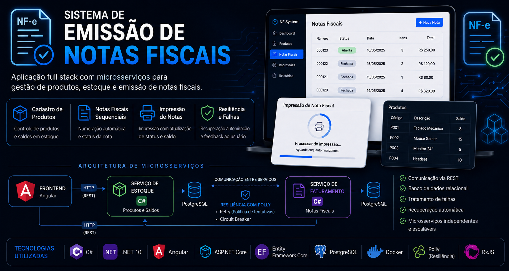

# Korp_Teste_Vitor — Sistema de Emissão de Notas Fiscais


Projeto técnico desenvolvido como parte do processo seletivo da Korp.

📄 **[Documentação técnica detalhada](DETALHAMENTO_TECNICO.md)** — resposta ponto a ponto a cada item pedido no documento de especificação (ciclos de vida do Angular, RxJS, bibliotecas, componentes visuais, gerenciamento de dependências, frameworks, tratamento de erros, LINQ).

## Tecnologias

| Camada | Stack |
|--------|-------|
| Frontend | Angular 18 + Angular Material |
| Backend | C# / .NET 10 (microsserviços) |
| Banco de dados | PostgreSQL (um por microsserviço) |
| Infraestrutura | Docker Compose |
| Resiliência | Polly v8 (via `Microsoft.Extensions.Http.Resilience`) |
| ORM | Entity Framework Core 10 |

## Arquitetura

```
Angular SPA (porta 4200)
    ↕ HTTP
┌──────────────┐   HTTP   ┌─────────────────┐
│ Inventory.Api│◄─────────│ Billing.Api     │
│ (porta 5001) │          │ (porta 5002)    │
└──────┬───────┘          └────────┬────────┘
       │                           │
   inventory                    billing
  (PostgreSQL)               (PostgreSQL)
```

Cada microsserviço possui seu próprio banco de dados (*database-per-service*).
A comunicação entre serviços é exclusivamente via HTTP com Polly (retry + circuit breaker).

## Como executar

### Pré-requisitos
- [Docker](https://www.docker.com/) e Docker Compose (para o modo recomendado)
- Para desenvolvimento local sem Docker nas APIs: [.NET 10 SDK](https://dotnet.microsoft.com/download) e [Node.js 18+](https://nodejs.org/) (com npm)

### Com Docker Compose (recomendado)

```bash
docker compose up --build
```

Acesse: http://localhost:4200

### Desenvolvimento local

Suba apenas os bancos de dados via Docker Compose (as APIs já vêm pré-configuradas em `appsettings.Development.json` para apontar para eles):
```bash
docker compose up -d inventory-db billing-db
```

**Backend — Inventory.Api:**
```bash
cd backend/Inventory.Api
dotnet run
# Swagger: http://localhost:5001/swagger
```

**Backend — Billing.Api:**
```bash
cd backend/Billing.Api
dotnet run
# Swagger: http://localhost:5002/swagger
```

**Frontend:**
```bash
cd frontend/notas-fiscais-app
npm install
npm start
# http://localhost:4200
```


## Demonstração do cenário de falha

```bash
# Derrubar o serviço de estoque
docker stop inventory-api

# Tentar imprimir uma nota no Angular
# → O circuit breaker (Polly) abre após as tentativas
# → Angular exibe mensagem: "Serviço de estoque indisponível"

# Restaurar
docker start inventory-api
```

## Funcionalidades

- ✅ Cadastro de produtos (código, descrição, saldo)
- ✅ Listagem de produtos com saldo em tempo real
- ✅ Criação de notas fiscais (numeração sequencial automática)
- ✅ Inclusão de itens na nota (produto + quantidade)
- ✅ Impressão de nota: debita estoque, fecha nota, exibe indicador de progresso
- ✅ Tratamento de falhas com circuit breaker (Polly)
- ✅ Concorrência otimista (coluna de sistema `xmin` do PostgreSQL como token de concorrência no EF Core)
- ✅ Idempotência na baixa de saldo (`IdempotencyKey`)
- ✅ Compensação automática em falha parcial de impressão

**Não implementado:** uso de Inteligência Artificial (um dos três diferenciais opcionais do desafio, junto com concorrência e idempotência — implementei os dois primeiros) e testes automatizados.

## Detalhamento técnico

### Angular — ciclos de vida utilizados
- `ngOnInit`: carregar dados iniciais via `HttpClient`
- `DestroyRef.onDestroy`: limpeza de estado/efeitos colaterais ao destruir o componente (substitui `ngOnDestroy` + `Subject/takeUntil`)

### RxJS utilizado
- `pipe`, `tap`, `catchError`, `EMPTY`, `switchMap`: no fluxo de impressão
- Requisições via `HttpClient` completam sozinhas (sem necessidade de unsubscribe manual); `DestroyRef.onDestroy` cobre limpeza de estado compartilhado (ex.: `pageContext`)
- Lazy loading de rotas: `loadComponent` com imports dinâmicos

### Componentes visuais (Angular Material + CDK)
- `MatFormField` + `MatInput` + `MatSelect` — formulários com Reactive Forms
- `MatProgressSpinner` — indicador de carregamento/impressão
- `MatSnackBar` — feedback de sucesso/erro
- `MatButton`, `MatIcon` — ações e ícones
- `MatDialog` — confirmação antes de ações destrutivas/impressão
- `MatDivider` — separadores visuais
- `MatRipple` (Angular CDK) — feedback tátil na navegação lateral
- Listagens de produtos e notas fiscais usam `@for` (control flow nativo do Angular, não `MatTable`), com layout próprio em CSS

### Outras bibliotecas
- `material-icons` — conjunto de ícones usado via `<span class="material-icons">`
- `zone.js` — detecção de mudanças do Angular (padrão do CLI)
- `tslib` — helpers de compilação TypeScript

### Backend C# — tratamento de erros
- `GlobalExceptionHandler` (`IExceptionHandler`, nativo do ASP.NET Core): captura todas as exceções não tratadas
- Exceções de domínio tipadas: `InsufficientBalanceException`, `ProductNotFoundException`, `InvoiceClosedException`, etc., mapeadas para o status HTTP correto
- Resposta no padrão `ProblemDetails` (RFC 9457) para todos os erros, incluindo conflitos de concorrência (`DbUpdateConcurrencyException` → 409)

### LINQ utilizado
```csharp
// Listagem ordenada com projeção para DTO
db.Products.OrderBy(p => p.Code)
           .Select(p => new ProductResponse(...))
           .ToListAsync()

// Próxima numeração sequencial
db.Invoices.MaxAsync(n => n.Number)

// Include para eager loading
db.Invoices.Include(n => n.Items).FirstOrDefaultAsync(n => n.Id == id)
```

### Frameworks utilizados (C#)
- **ASP.NET Core Web API** (.NET 10, minimal hosting): framework principal dos dois microsserviços
- **Entity Framework Core 10** (`Npgsql.EntityFrameworkCore.PostgreSQL`): ORM para acesso ao PostgreSQL
- `Microsoft.Extensions.Http.Resilience` (Polly v8): retry e circuit breaker na comunicação HTTP entre serviços
- `Swashbuckle.AspNetCore`: documentação Swagger/OpenAPI

> O desafio permitia Go ou C#. Optei por C#/.NET por ter mais domínio prático da linguagem e do ecossistema (EF Core, ASP.NET Core), o que me permitiu focar tempo nas decisões de arquitetura (concorrência, idempotência, compensação de falha) em vez de aprender sintaxe. Reconheço que Go tende a ser mais leve/performático para microsserviços, mas a escolha aqui foi pragmática.

### Gerenciamento de dependências
- **Backend (C#)**: NuGet, via `<PackageReference>` nos `.csproj` de cada microsserviço (não se aplica Golang, pois o backend foi implementado em C#/.NET)
- **Frontend (Angular)**: npm, via `package.json`/`package-lock.json`
